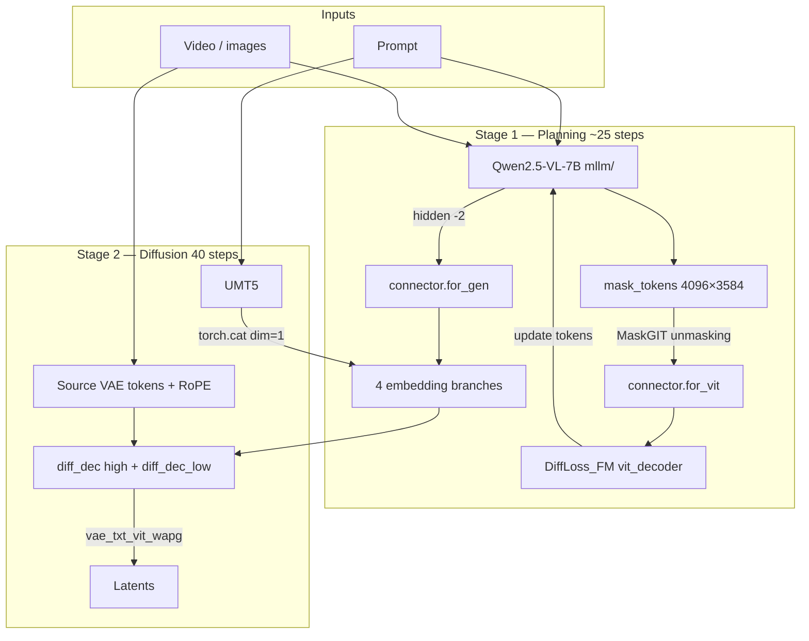
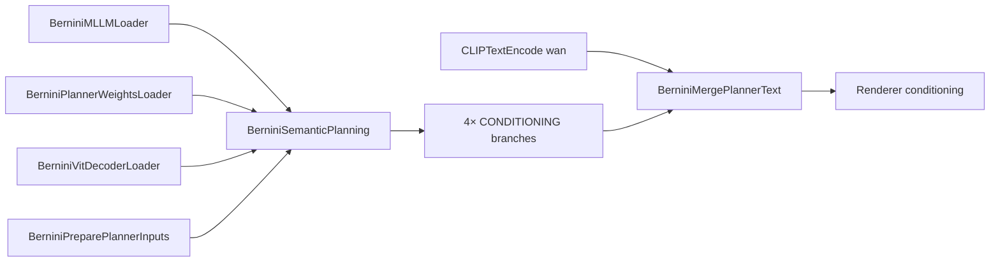

# Full Bernini in ComfyUI — Implementation Plan

> **Status:** Implementation (2026-06-12) — Phases 1–4 code landed; validation pending  
> **Goal:** Extend the existing Bernini-R substrate in this ComfyUI fork to support **full Bernini** (Qwen2.5-VL planner + VIT decoder + chained renderer guidance), matching the official [ByteDance/Bernini](https://github.com/bytedance/Bernini) inference stack.  
> **Baseline docs:** `Bernini/docs/ARCHITECTURE_REFERENCE.md`, `memory-agent/projects/bernini-comfyui/index.md`

**Checkpoint:** [ByteDance/Bernini-Diffusers](https://huggingface.co/ByteDance/Bernini-Diffusers) — self-contained diffusers layout with planner, planning weights, and Wan2.2 decoder configs.

---

## 1. Executive Summary

| Layer | Bernini-R (today in ComfyUI) | Full Bernini (target) |
|-------|------------------------------|------------------------|
| **Conditioning node** | `BerniniConditioning` — VAE in-context tokens | Same + planner-driven text branches |
| **Text** | UMT5 only (`CLIPLoader` type `wan`) | UMT5 **concat** planner features (4096-d) |
| **Planner** | None | Qwen2.5-VL-7B + mask tokens + planning loop |
| **VIT decoder** | None | `DiffLoss_FM` flow-matching MLP |
| **Connector** | None | `MLPConnector` gen (→4096) + vit (→3584) branches |
| **DiT** | `WanModel` + optional Bernini-R weights | `diff_dec` + `diff_dec_low` experts (cotrain) |
| **Guidance** | Standard 2-branch CFG | `vae_txt_vit_wapg` chained APG (4+ branches) |
| **Offload** | Generic ModelPatcher | Stage-wise: planner → CPU, T5 → CPU, one DiT expert on GPU |

**Key insight:** ComfyUI already implements the **hard DiT substrate** (multi-source `context_latents`, source-id RoPE, target-only head). Full Bernini is mostly **new upstream nodes** (planner stack) + **custom sampler** (chained guidance) + **weight tooling** — not a rewrite of `WanModel`.

---

## 2. Current ComfyUI State (Bernini-R)

### 2.1 Files touched by Bernini today

| File | Role |
|------|------|
| `comfy_extras/nodes_bernini.py` | Single node: `BerniniConditioning` |
| `comfy/ldm/wan/model.py` | `context_latents` concat, `source_id` RoPE, strip context after head |
| `comfy/model_base.py` (`WAN21`) | Passes `context_latents` through `extra_conds`; context-window slicing |
| `nodes.py` | Registers `nodes_bernini.py` |

### 2.2 What works

- VAE-encode source video / reference images → `context_latents` on positive & negative
- Integer `source_id` RoPE (1, 2, 3…) for each stream; target noisy latent uses id 0
- Task inference from connected inputs (t2v, v2v, rv2v, r2v, ads2v)
- Wan 2.1 VAE layout: **16 channels**, spatial ÷8, temporal `(length-1)//4+1` frames
- Dual-expert workflow via **two UNET checkpoints** + two `KSamplerAdvanced` nodes (manual step split)

### 2.3 Gaps vs official Bernini-R (even before full Bernini)

| Gap | Impact |
|-----|--------|
| **No chained guidance** (`rv2v`, `omega_*`) | Quality / instruction following diverges from official |
| **Same `context_latents` on pos & neg** | Official uses different combos per guidance branch |
| **No `max_trained_src_id` interpolation** | >5 reference streams may extrapolate RoPE |
| **No Bernini-R weight loader** | `diff_dec.*` diffusers keys ≠ Comfy `WanModel` keys |
| **No conversion script** | Must repack HF weights manually |
| **Standard CFG only** | No APG / `normalized_guidance_chain` |

These gaps affect **both** Bernini-R parity and full Bernini (renderer stage).

---

## 3. Official Full Bernini Pipeline (reference)



**Official offload pattern** (`pipeline.py`):

1. Run planning on GPU (Qwen + connector + vit_decoder)
2. Move `mllm`, `connector`, `vit_decoder` → **CPU**
3. T5 encode on GPU → T5 → **CPU**
4. Diffusion: one DiT expert on GPU at a time; swap at `switch_dit_boundary=0.875`

---

## 4. Weight Layout — [Bernini-Diffusers](https://huggingface.co/ByteDance/Bernini-Diffusers)

### 4.1 HF package structure

```text
Bernini-Diffusers/
  bernini/                          # Joint planning + renderer weights (sharded)
    model.safetensors.index.json    # 38 shards, ~180 GB
    model-00001-of-00038.safetensors ...
  mllm/                             # Qwen2.5-VL-7B (separate, NOT in bernini shard)
  t5_text_encoder/
  t5_tokenizer/
  vae/
  scheduler/
  config.json
  transformer_config.json           # DiT architecture only (no weights)
  transformer_2_config.json
```

### 4.2 `bernini/model.safetensors.index.json` top-level prefixes

From [weight index](https://huggingface.co/ByteDance/Bernini-Diffusers/resolve/main/bernini/model.safetensors.index.json):

| Prefix | Component | ~Purpose | ComfyUI target |
|--------|-----------|----------|----------------|
| `vit_decoder.*` | `DiffLoss_FM` (`SimpleMLPAdaLN`, width 4096, depth 16) | VIT flow-matching decoder | New `BerniniVitDecoder` model |
| `connector.pred_vit.*` | MLPConnector vit branch | 3584→3584 for VIT planning | Part of planner bundle |
| `connector.proj_gen.*` | MLPConnector gen branch | 3584→4096 for renderer | Part of planner bundle |
| `mask_tokens` | Single tensor | 4096 learnable mask tokens | Planner state |
| `diff_dec.transformer.*` | Wan DiT (diffusers keys) | High-noise expert (`cotrain`) | Comfy UNET high-noise |
| `diff_dec_low.transformer_2.*` | Wan DiT (diffusers keys) | Low-noise expert (`cotrain`) | Comfy UNET low-noise |

**Note:** `mllm` weights live in `mllm/` — load Qwen separately; do not expect them inside `bernini/` shards.

### 4.3 Conversion strategy (sharded → separate Comfy-ready files)

**Phase A — Extract & split (one-time script, `tools/convert_bernini_weights.py`)**

| Output file | Source keys | Notes |
|-------------|-------------|-------|
| `bernini_planner.safetensors` | `connector.*`, `mask_tokens` | Small (~few GB) |
| `bernini_vit_decoder.safetensors` | `vit_decoder.*` | Small |
| `bernini_high_noise.safetensors` | `diff_dec.transformer.*` (+ EMA preference) | Map to Comfy Wan keys |
| `bernini_low_noise.safetensors` | `diff_dec_low.transformer_2.*` | Map to Comfy Wan keys |
| *(existing)* `mllm/` | HF folder as-is | Qwen2.5-VL standard layout |
| *(existing)* `t5_text_encoder/`, `vae/` | HF folders | Already compatible with Comfy Wan loaders |

**Phase B — Diffusers → Comfy key remap (DiT only)**

Official Bernini uses diffusers `WanTransformer3DModel` keys. Comfy `WanModel` uses:

| Diffusers (`diff_dec.transformer`) | ComfyUI (`WanModel`) |
|-----------------------------------|----------------------|
| `patch_embedding.*` | `patch_embedding.*` |
| `blocks.{i}.attn1.*` | `blocks.{i}.self_attn.*` |
| `blocks.{i}.attn2.*` | `blocks.{i}.cross_attn.*` |
| `blocks.{i}.ffn.*` | `blocks.{i}.ffn.*` |
| `blocks.{i}.scale_shift_table` | `blocks.{i}.modulation` |
| `condition_embedder.*` | `text_embedding.*` |
| `time_embedder.*` | `time_embedding.*` |
| `scale_shift_table` (time proj) | `time_projection.*` |
| `proj_out` / norm+proj | `head.head.*`, `head.modulation` |

Reference: Comfy-Org `Wan_2.2_ComfyUI_Repackaged` + `bernini/weights.py` prefix logic (`diff_dec.transformer.` → bare).

**Phase C — Optional joint file**

For distribution convenience, a single `bernini_full.safetensors` with prefixed keys (`planner.`, `vit_decoder.`, `unet_high.`, `unet_low.`) is possible, but **runtime should load separate components** for RAM offload.

---

## 5. What Must Be Built in ComfyUI

### 5.1 Tier 0 — Prerequisites (Bernini-R parity)

Do these first; full Bernini renderer depends on them.

| # | Deliverable | Files / approach |
|---|-------------|------------------|
| 0.1 | **Weight conversion script** | `tools/convert_bernini_weights.py` — shard read, key remap, split outputs |
| 0.2 | **Bernini chained guidance sampler** | `comfy_extras/nodes_bernini_sampler.py` — `BerniniGuider` |
| 0.3 | **Guidance modes** | `rv2v`, `v2v`, `v2v_chain`, `t2v`, `v2v_apg`, `t2v_apg`, `rv2v_wapg`, `vae_txt_vit_wapg` ✅ |
| 0.4 | **Per-branch context subsets** | `comfy/bernini/context.py` + `bernini_num_videos` metadata |
| 0.5 | **Omega controls** | `omega_vid`, `omega_img`, `omega_txt` on `BerniniGuider` |
| 0.6 | **APG** | `comfy/bernini/guidance.py` |
| 0.7 | **UniPC + flow_shift** | Use `BasicScheduler` / Wan blueprint with `flow_shift=5` (workflow) |

### 5.2 Tier 1 — Planner model classes (CPU-offloadable)

Port minimal inference code from official repo (do not import VeOmni in ComfyUI core).

| Component | Official source | ComfyUI location (proposed) |
|-----------|-----------------|------------------------------|
| `MLPConnector` | `bernini/models/bernini.py` | `comfy/ldm/bernini/connector.py` ✅ |
| `DiffLoss_FM` + `SimpleMLPAdaLN` | `bernini/models/diffloss_fm.py` | `comfy/ldm/bernini/vit_decoder.py` ✅ |
| `mask_tokens` | `BerniniModel` | Loaded with planner weights |
| Qwen2.5-VL forward | `modeling_qwen2_5_vl.py` (vendored subset) | `comfy/text_encoders/qwen25_vl_bernini.py` OR reuse existing `qwen_vl` + extend |

**Qwen loading options:**

| Option | Pros | Cons |
|--------|------|------|
| **A. New `CLIPLoader` type `qwen25_vl`** | Clean separation, explicit offload | Large loader work |
| **B. Dedicated `BerniniMLLMLoader` node** | Isolated from CLIP graph | Duplicate loader patterns |
| **C. Reuse Hunyuan/Qwen image CLIP path** | Partial code exists (`qwen_vl`, DualCLIPLoader) | Bernini chat template + multimodal packing differs |

**Recommendation:** **Option B** for v1 — `BerniniMLLMLoader` loads `mllm/` from Bernini-Diffusers, `offload_device=cpu`, `load_device=cuda` only during planning node.

### 5.3 Tier 2 — Data processing (match `bernini_process`)

| Piece | Official | ComfyUI node |
|-------|----------|--------------|
| Chat template + token packing | `bernini_template.py`, `bernini_process.py` | `BerniniPreparePlannerInputs` |
| Qwen VIT features @ fps/8 | `data_utils.get_vit_features` | Inside prepare node |
| VAE latents @ full fps | `get_vae_features` | Can reuse `BerniniConditioning` encode path |
| Attention masks, position ids | `bernini_process_sample` | Tensor outputs on PLANNER type |
| Mask target VIT tokens | `post_process_input_embeds` | Planning node internal |

### 5.4 Tier 3 — Planning nodes (helper nodes)



| Node | Inputs | Outputs | GPU lifecycle |
|------|--------|---------|---------------|
| `BerniniMLLMLoader` | path to `mllm/` | `BERNINI_MLLM` | Load to GPU on demand |
| `BerniniPlannerWeightsLoader` | `bernini_planner.safetensors` | connector + mask_tokens | Small, can stay CPU |
| `BerniniVitDecoderLoader` | `bernini_vit_decoder.safetensors` | `BERNINI_VIT_DECODER` | GPU during planning |
| `BerniniPreparePlannerInputs` | prompt, images, video, processor config | packed tensors dict | CPU tensors |
| `BerniniSemanticPlanning` | mllm, planner weights, vit decoder, prepared inputs, `planning_step`, `vit_*_cfg` | 4 conditioning embed tensors + optional debug | **Offload all planner models to CPU after** |
| `BerniniMergePlannerText` | UMT5 conditioning + 4 planner embeds | merged conditioning for renderer | CPU/GPU embeds only |

Planning loop logic: port `BerniniPipeline.sample_vit_embed()` (~25 steps, MaskGIT cosine schedule, `sample_vit_decoder`).

### 5.5 Tier 4 — Renderer integration

| Node | Role |
|------|------|
| `BerniniConditioning` | **Keep** — VAE context for renderer (may share encode with planner prep) |
| `BerniniFullConditioning` | Optional wrapper: planner merge + `BerniniConditioning` + latent |
| `BerniniChainedSampler` | Replaces dual `KSamplerAdvanced` + implements `sample_bernini_wvitcfg` |
| `BerniniExpertSwitch` | Optional: auto high/low expert with CPU swap + `omega_scale` |

Renderer text path:

```python
# Official (pipeline.py ~1083-1088)
cond_wtxt_wvit = cat([t5_embeds, planner_wtxt_wvit], dim=1)   # pad to max_sequence_length=512
cond_wotxt_wovit = cat([neg_t5_embeds, planner_wotxt_wovit], dim=1)
# ... 4 branches total for vae_txt_vit_wapg
```

ComfyUI: extend conditioning dict with keys like `cross_attn_patch` or custom `bernini_text_embeds` branches consumed by custom guider.

**DiT weights:** Load converted `bernini_high_noise.safetensors` / `bernini_low_noise.safetensors` via existing `UNETLoader` (same as Bernini-R).

### 5.6 Tier 5 — Conditioning contract extensions

Current Comfy conditioning keys for Wan:

- `cross_attn` — UMT5 embeddings
- `context_latents` — list of VAE latent tensors

Full Bernini needs **additional guider inputs**:

| Key | Shape (typical) | Used in branch |
|-----|-----------------|----------------|
| `cross_attn` (T5+planner wtxt_wvit) | `[1, ≤512, 4096]` | VTI / full |
| `bernini_wtxt_wovit` | `[1, ≤512, 4096]` | text-only branch |
| `bernini_wotxt_wvit` | `[1, ≤512, 4096]` | VIT-only branch |
| `bernini_wotxt_wovit` | `[1, ≤512, 4096]` | null baseline |
| `context_latents` | list `[1,16,T,H,W]` | per combo subset |

Implement via custom `BerniniGuider` class (similar to `APG` guider pattern in `nodes_apg.py`) rather than overloading `cross_attn` alone.

---

## 6. RAM / GPU Offload Design

### 6.1 Memory budget (14B full Bernini, approximate)

| Component | VRAM (bf16) | Strategy |
|-----------|-------------|----------|
| Qwen2.5-VL-7B | ~14 GB | Load GPU → plan → **offload CPU** |
| VIT decoder | ~1 GB | Same |
| Connector + mask_tokens | <0.5 GB | Keep on CPU |
| UMT5-XXL | ~10 GB | Encode → **offload CPU** |
| DiT expert (one) | ~28 GB | Only one on GPU; swap at boundary |
| VAE | ~1 GB | Encode/decode bursts |
| Activations (video 81 frames) | High | Existing lowvram + context windows |

**Target workflow memory:** ~30–35 GB peak during diffusion (one DiT + VAE), not ~70 GB (all models resident).

### 6.2 ComfyUI mechanisms to use

| Mechanism | Application |
|-----------|-------------|
| `ModelPatcher` `load_device` / `offload_device` | Each loader node sets CPU offload default |
| `model_management.load_models_gpu()` + `unload_model_clones()` | After planning node: explicit unload |
| `partially_load` / lowvram | DiT during sampling |
| `--gpu-only` | User override keeps planner on GPU (faster re-runs) |
| Node `IS_CHANGED` / cache | Cache planner outputs keyed by inputs → skip re-planning |

### 6.3 Official parity offload sequence

```
1. BerniniSemanticPlanning.execute():
   - load mllm, vit_decoder to GPU
   - run sample_vit_embed (25 steps)
   - move mllm, connector, vit_decoder to CPU
   - return embed tensors (CPU)

2. BerniniMergePlannerText / T5 encode:
   - load T5 to GPU briefly
   - cat planner + T5 embeds
   - offload T5

3. BerniniChainedSampler:
   - load high-noise UNET → sample until boundary
   - offload high, load low-noise UNET
   - continue sampling
```

---

## 7. Implementation Phases & Milestones

### Phase 0 — Tooling & validation (1–2 weeks)

- [x] `tools/convert_bernini_weights.py` — split `bernini/` shards → 5 safetensors + key remap for DiT (see `tools/README_BERNINI_CONVERT.md`)
- [ ] Validate converted high/low noise load in `UNETLoader` without missing keys
- [ ] Download [Bernini-Diffusers](https://huggingface.co/ByteDance/Bernini-Diffusers) test subset (one shard + small keys)
- [ ] Golden test: official `infer_multi_gpu.py` vs ComfyUI on `assets/testcases/t2v/t2v.json` (Bernini-R first)

### Phase 1 — Bernini-R parity (2–3 weeks)

- [x] `BerniniGuider` with `rv2v` / `v2v_apg` / `t2v_apg` / APG modes
- [x] Per-branch `context_latents` selection (`comfy/bernini/context.py`)
- [x] Blueprint: `blueprints/Bernini-R v2v.json`
- [ ] Match official output on `v2v_case1.json` (seed 42, 40 steps)

### Phase 2 — Planner weights & models (2–3 weeks)

- [x] Port `MLPConnector`, `DiffLoss_FM` to `comfy/ldm/bernini/`
- [x] Loader nodes + weight load from split safetensors
- [x] `BerniniMLLMLoader` for `mllm/` (Qwen2.5-VL-7B)
- [ ] Unit test: vit_decoder sample matches official on fixed tensor

### Phase 3 — Planning pipeline (3–4 weeks)

- [x] Port `bernini_process_sample` + chat template (`comfy/bernini/planner_*.py`)
- [x] `BerniniPreparePlannerInputs` + `BerniniSemanticPlanning`
- [ ] Offload verified: GPU memory drops after planning node
- [ ] Compare planner embed shapes vs official on `i2i.json`

### Phase 4 — Full renderer glue (2–3 weeks)

- [x] `BerniniMergePlannerText` — T5 concat + pad/truncate to 512
- [x] `vae_txt_vit_wapg` in `BerniniGuider`
- [x] End-to-end blueprint: `blueprints/Full Bernini v2v.json`
- [ ] Visual + latent diff vs official on `v2v_case1.json`

### Phase 5 — Polish

- [ ] Gradio-equivalent defaults in blueprint (omegas from `scripts/bernini/run_v2v.sh`)
- [ ] `max_trained_src_id` + interpolation UI on `BerniniConditioning`
- [ ] Optional planning result cache node
- [ ] Documentation + example workflows

---

## 8. Risk Register

| Risk | Mitigation |
|------|------------|
| Qwen2.5-VL in ComfyUI incomplete vs Bernini vendored model | Vendor minimal forward + hidden_states[-2]; or pin transformers version |
| 180 GB shard download / disk | Script streams shards; only read needed keys |
| Varlen attention mismatch | Accept batched attention approximation for v1; document quality delta |
| 4 forwards/step × 40 steps = slow | Batch where possible; cache unchanged branches; APG only where needed |
| `max_sequence_length=512` concat overflow | Match official pad/truncate; warn in UI |
| Chat template drift | Copy template strings verbatim from `bernini_template.py` |
| cotrain dual decoders vs two UNET files | Two files from `diff_dec` + `diff_dec_low` prefixes — matches Comfy pattern |

---

## 9. Testing Matrix

| Test case | Model | Guidance | Validates |
|-----------|-------|----------|-----------|
| `t2i/t2i.json` | Full | `vae_txt_vit_wapg` | Planning + single frame |
| `v2v/v2v_case1.json` | Full | `vae_txt_vit_wapg` | Video edit end-to-end |
| `rv2v/rv2v_case1.json` | Full | `vae_txt_vit_wapg` | Multi-source + refs |
| `t2v/t2v.json` | Bernini-R | `t2v_apg` | Renderer-only baseline |
| Same + seed 42 | Both | — | Pixel/latent L∞ diff vs official |

---

## 10. File Map (proposed)

```text
ComfyUI/
  docs/FULL_BERNINI_IMPLEMENTATION_PLAN.md    # this file
  tools/convert_bernini_weights.py
  comfy/
    ldm/bernini/
      connector.py
      vit_decoder.py
      planning.py          # mask schedule, planning loop helpers
    text_encoders/
      qwen25_vl_bernini.py # optional thin wrapper
  comfy_extras/
    nodes_bernini.py         # existing BerniniConditioning
    nodes_bernini_planner.py # MLLM, planning, merge
    nodes_bernini_sampler.py # chained guidance
  blueprints/
    Bernini-R v2v.json
    Bernini Full v2v.json
```

---

## 11. References

- [ByteDance/Bernini-Diffusers](https://huggingface.co/ByteDance/Bernini-Diffusers) — full checkpoint layout
- [bernini/model.safetensors.index.json](https://huggingface.co/ByteDance/Bernini-Diffusers/resolve/main/bernini/model.safetensors.index.json) — joint shard index (~180 GB)
- [Official Bernini repo](https://github.com/bytedance/Bernini) — inference reference
- `Bernini/docs/ARCHITECTURE_REFERENCE.md` — architecture comparison baseline
- `Bernini/bernini/weights.py` — prefix resolution for DiT shards
- `Bernini/bernini/pipeline.py` — `sample_vit_embed`, T5 concat, offload sequence
- `Bernini/bernini/models/wan_diffusion.py` — `sample_bernini_wvitcfg`, APG
- ComfyUI `comfy_extras/nodes_bernini.py` — current conditioning node
- ComfyUI `comfy/ldm/wan/model.py` — `context_latents` + source-id RoPE

---

*Update this plan when phases complete or ComfyUI fork structure changes.*
